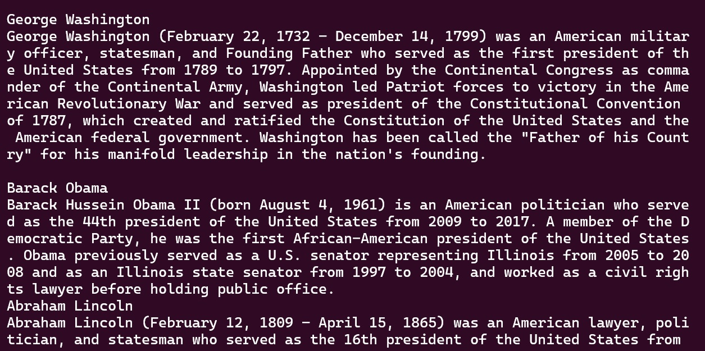

# Wikipedia Scraper
This project requests a list of world leaders from the API availble at https://country-leaders.onrender.com and scrap the first paragraph from their respective wikipedia entries.

## Installation
This program requires python 3.10.4. Included in this repository is a requirements.txt file which includes the requirements. In order to install them you can run ```python -m pip install requirements.txt``` 
Make sure to do so in a virtual environment to avoid conflicts. 
## Usage
Run ```leaders_scrapper.py```. The program will print the leaders names and a short introduction in the terminal. The full data will be written to a file called ```leaders.json``` according to the following pattern::
```py
{"us" : [
	{
	"first_name" : "George",
	"last_name" : "Washington",
	"wikipedia_url" : "https://www.wikipedia.com/Geor...",
	"short_introduction" : "George Washington (February 22...",
	"start_mandate" : "1789-04-30",
	"end_mandate" : "1797-03-04",
	"place_of_birth" : "Westmoreland County"
	"birth_date" : "1732-02-22",
	"death_date" : "1799-12-14",
	"id": "Q23"
	},
	{
	"first_name" : "Barack",
	"last_name" : "Obama",
	"wikipedia_url": "https://www.wikipedia.com/Barack..."
	"short_introduction" : "Barack Hussein Obama II (born"...",
	"start_mandate" : "2009-01-20",
	"end_mandate" : "2017-01-20",
	"place_of_birth" : "Kapiolani Medical Center for...", 
	"date_of_birth" : "1961-08-04",
	"date_of_death" : null,
	"id": "Q76"
	},
	"etc..."	
	]
"ru" : [
	"etc..."
	]
}```

## Made by Henrique Rauen
This program was done in ~11 hours as part of the junior data analyst course @ becode.
Jun 2023
